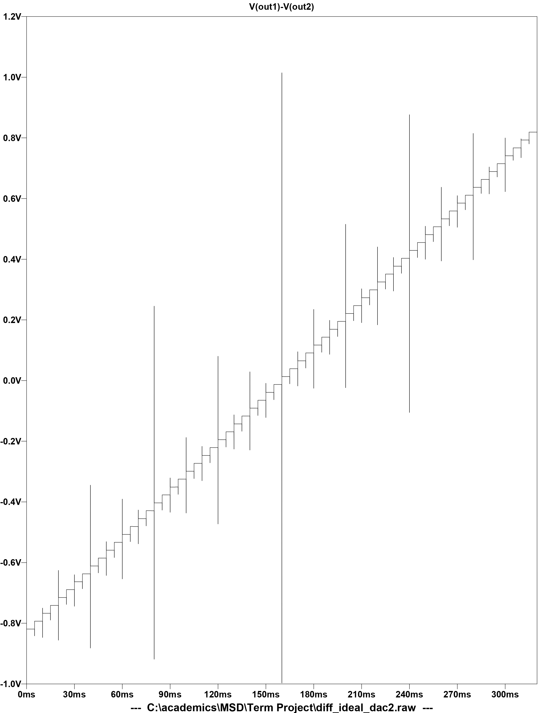
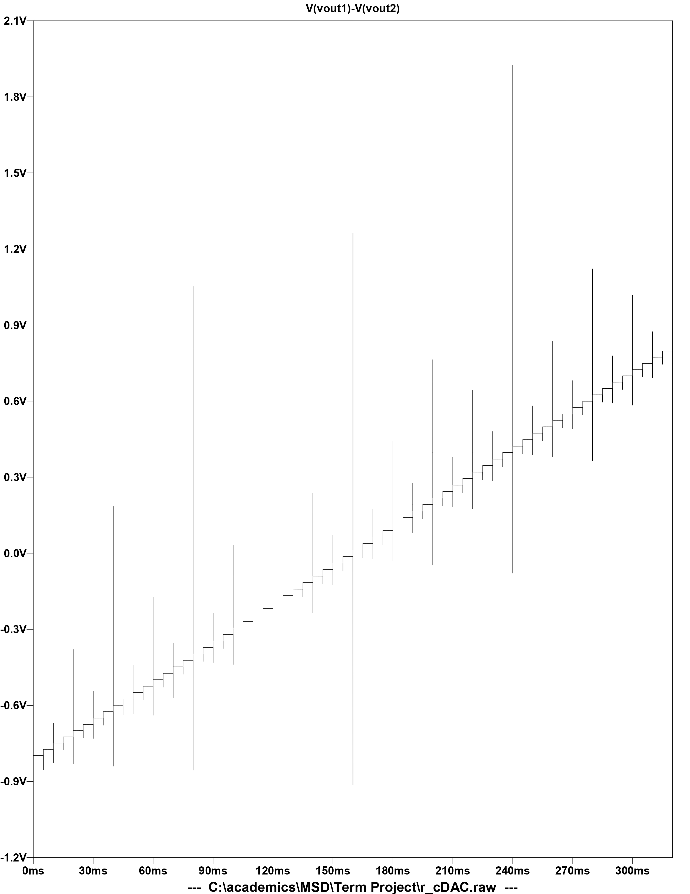
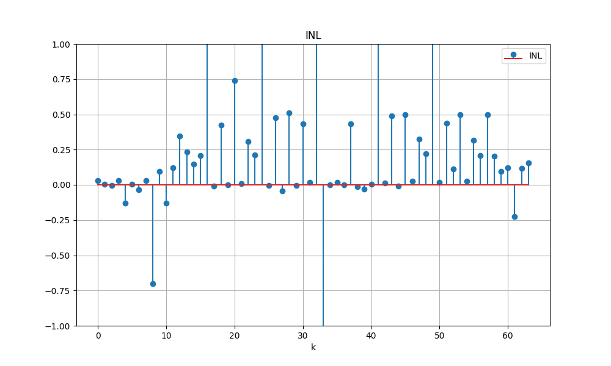
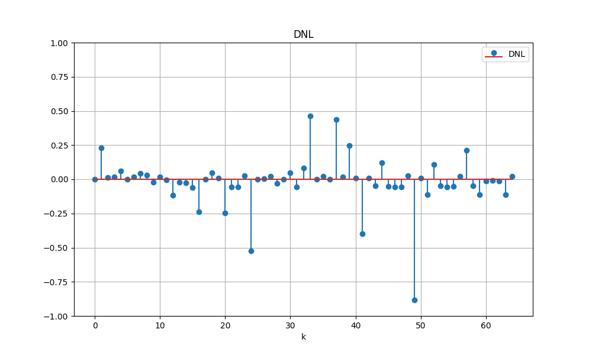

# **6-Bit Fully Differential Current Steering DAC**

## **Project Overview**
This project involves designing and simulating a 6-bit fully differential current-steering Digital-to-Analog Converter (DAC) using LTSpice. The design focuses on achieving linearity and power efficiency while meeting key specifications.

---

## **Specifications**
- **Process Technology**: 180 nm  
- **Analog Supply Voltage**: 1.8 V  
- **Full-Scale Voltage (pk-to-pk)**: 1.6 V  
- **Analog Input Range**: 0 - 1.6 V  
- **INL (MAX)**: 0.5 LSB  
- **DNL (MAX)**: 0.5 LSB  
- **Maximum Static Power**: < 1 mW  

---

## **Design Steps**
1. **Ideal Current Source Design**:  
   - Used ideal current sources to implement the DAC and plotted **transfer characteristics**.  
2. **PMOS Current Source Design**:  
   - Replaced ideal sources with PMOS current sources, integrated with a **row-column decoder**.  
   - Simulated **transfer characteristics**, **INL**, and **DNL**.

---

## **Simulation Outputs**
Results can be found in the **Results** folder:  
- **Transfer Characteristics**: Ideal vs Non-Ideal DAC.  
- **INL and DNL Plots**: Analyze linearity performance.

Example output plots:  
1. **Ideal DAC Transfer Characteristic**  
     

2. **Non-Ideal DAC Transfer Characteristic**  
     

3. **INL**  
   

4. **DNL**  
   

---

## **Resources**
- **Models Folder**: Contains PMOS and NMOS models (`tsmc018.lib`) required for simulation.  
- Ensure the `.lib` file is included in the LTSpice schematic to run simulations successfully.  

---

## **How to Run the Project**
1. **Install LTSpice**:  
   Download and install LTSpice if not already installed.
   
2. **Set Up Models**:  
   - Copy the `tsmc018.lib` file from the **Resources** folder.  
   - Include the `.lib` file in your circuit schematic (use `.include tsmc018.lib` in LTSpice).  

3. **Run Simulations**:  
   - Open the LTSpice files (`diff_ideal_dac2.asc`, `r_cDAC.asc`) in LTSpice.  
   - Run the simulation to generate **transfer characteristics**, **INL**, and **DNL** plots.

4. **View Results**:  
   - Check the generated results or refer to the pre-saved plots in the **Results** folder.

---

## **Conclusion**
The design meets specified performance targets, with INL and DNL under 0.5 LSB. The results validate the effectiveness of the ideal and non-ideal DAC implementations.

---
